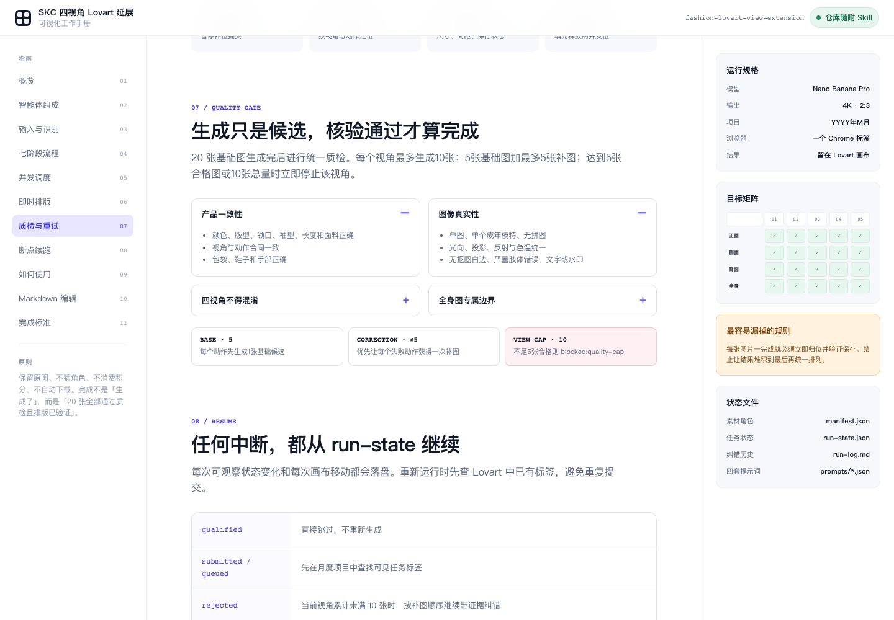

# SKC 四视角 Lovart 批量延展智能体

这是一套由 Codex 驱动的时装延展图自动化工作流。它扫描一个 SKC 或整批 SKC 的 `正面/侧面/背面/全身` 参考图，为每个视角生成 5 个动作提示词，通过 Chrome 操作 Lovart，并在逐张质检后形成 20 张合格结果。



## 它由什么组成

```text
Codex                         运行主体：理解、视觉分析、调度与质检
  ↓
skill/                        核心能力包：规则、模板和确定性脚本
  ↓
Chrome + Lovart               外部执行环境：上传、排队、生图和画布排版

docs/handbook.html            人类说明书：阅读流程、查看全部 Markdown
tools/build_handbook.mjs      文档构建器：从 skill/ 重新生成 HTML
```

`docs/handbook.html` 不是 Skill 本身。正式规则的唯一真源是 [`skill/`](skill/) 目录；HTML 中的编辑只会保存在浏览器本地草稿中。

## 核心能力

- 支持单个 SKC 和批次根目录。
- 不按 `1/2/3/4` 猜图片作用，而是根据画面分配人物、产品、场景、构图和配饰角色。
- 正面、侧面、背面、全身各生成 5 个独立动作。
- Nano Banana Pro、4K、2:3。
- Lovart 最多同时保留 10 个未完成任务，不提交第 11 个。
- 每张图完成后立即放入对应视角行，不等最后再批量整理。
- 全部 20 张基础结果完成后统一质检；每个视角最多生成10张，包括5张基础图和最多5张补图。
- 单个 SKC 理论最多生成40张候选图，但最终目标仍是四个视角各5张、共20张合格图。
- 全身图必须从头顶到脚底完整入镜，并保留上下安全边距。
- 支持状态落盘和断点续跑，不自动下载，也不自动消耗积分。

## 目录结构

```text
fashion-lovart-view-extension/
├── README.md
├── skill/
│   ├── SKILL.md
│   ├── agents/openai.yaml
│   ├── scripts/
│   └── references/
├── docs/
│   ├── handbook.html
│   └── handbook-preview.png
└── tools/
    ├── build_handbook.mjs
    └── handbook-template.html
```

## 安装

先克隆仓库，然后把正式能力包复制到 Codex 的个人 Skills 目录。目标目录名必须保持为 `fashion-lovart-view-extension`。

```bash
git clone https://github.com/judebrisbylg-matthew/image-skill.git
mkdir -p ~/.codex/skills/fashion-lovart-view-extension
rsync -a --delete \
  image-skill/fashion-lovart-view-extension/skill/ \
  ~/.codex/skills/fashion-lovart-view-extension/
```

随后重启或刷新 Codex，使新 Skill 被发现。

## 运行前准备

1. 安装并启用 Codex 的 Chrome 控制扩展，允许访问上传文件。
2. 在 Chrome 中登录 Lovart。
3. 确认可以使用 Nano Banana Pro、4K 和 2:3。
4. 准备单个 SKC 或批次根目录。

推荐输入结构：

```text
batch-root/
└── your-skc-id/
    ├── 正面/
    ├── 侧面/
    ├── 背面/
    └── 全身/
```

## 使用

单个 SKC：

```text
$fashion-lovart-view-extension /path/to/your-skc-id
```

整个批次：

```text
$fashion-lovart-view-extension /path/to/batch-root
```

仅分析并生成提示词：

```text
使用 $fashion-lovart-view-extension 分析这个批次并生成提示词，暂时不要进入 Lovart。
路径：/path/to/batch-root
```

## 查看可视化手册

下载或克隆仓库后，用浏览器直接打开 [`docs/handbook.html`](docs/handbook.html)。手册包含：

- 智能体、Skill、Chrome、Lovart 和 HTML 的关系图。
- 输入识别、并发调度、即时排版、质检与断点续跑说明。
- Skill 当前 8 份 Markdown 原文和实时预览编辑器。

## 修改规则并重建 HTML

先修改 `skill/` 下的正式 Markdown，再运行：

```bash
node fashion-lovart-view-extension/tools/build_handbook.mjs
```

脚本会读取正式 Skill 文件并重新生成 `docs/handbook.html`。不要把 HTML 本地草稿当成正式规则。

## 完成标准

单个 SKC 只有在以下条件同时成立时才算完成：

- 正面、侧面、背面、全身各有 5 张合格图。
- 20 个当前合格结果位于四行主图区的正确动作槽位。
- 所有补图仍在所属视角右侧的补图带。
- 每个视角累计图片不超过10张，达到上限仍不足5张合格图时标记 `blocked:quality-cap`。
- 全身图均完整包含头顶、脸部、身体、双脚与鞋子。
- 没有使用积分加速，也没有自动下载结果。
